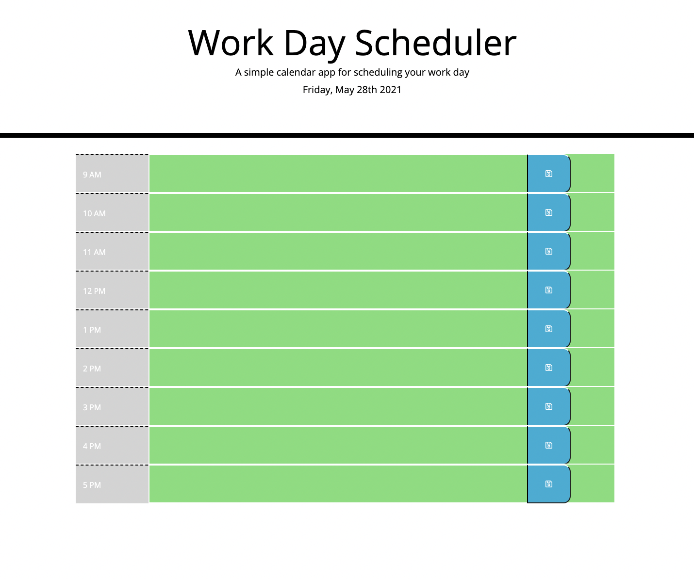
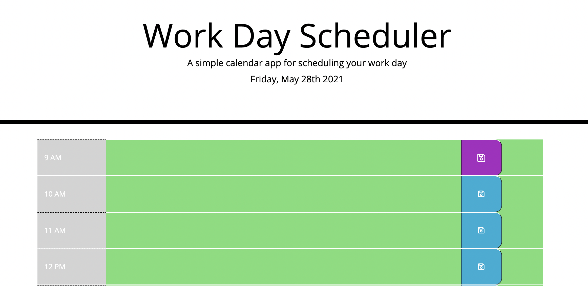
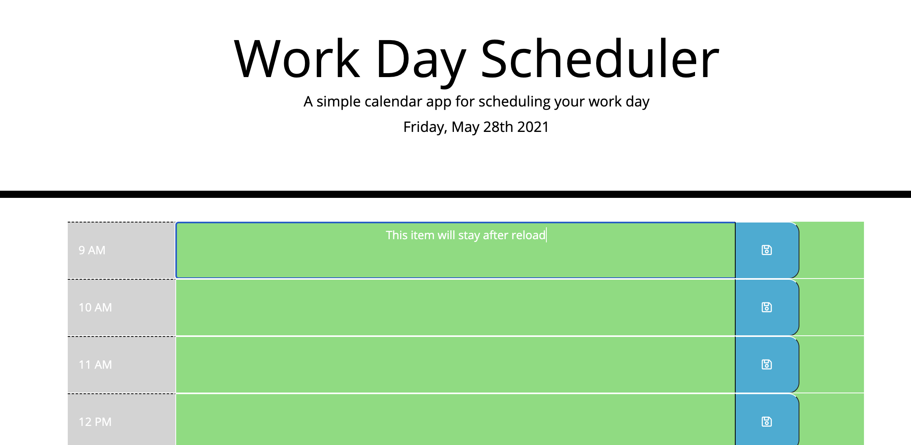

# Workday Scheduler
## Description:
- Created a simple workday scheduler, which tells the user the current day and date, divides the day by the hour, identifies past, current and future hours by color-coding the background of the specific container, and lastly, it allows the user to save any events/acitivities into their browser's local storage.
## Process:
 1. Created a HTML, CSS and JS files
 2. Linked all files accordingly
 3. Created divs for all rows and columns
 4. Formatted all applicable classes to "row" so I could later format to a GRID layout
 5. Added momentjs on javascript file to display the current day and date on the header
 6. Each hour is color coded to represent past(gray), present(red) and future(green) events
 7. Upon clicking the save button, the user input will be storage in their browser's local storage
 8. Upon reloading the page, the user's text input will remain on the page

 ## Deployment:
 - Link to application: https://agonzalvez.github.io/workday-scheduler/
 - App screenshot(s):

 
 ## -------------------------------------------------
 
 ## -------------------------------------------------
 